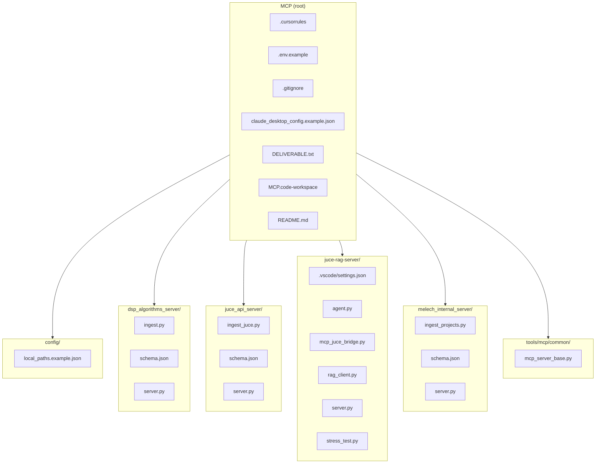

# MCP Repository Structure

```
MCP/
├── .cursorrules
├── .env.example
├── .gitignore
├── claude_desktop_config.example.json
├── DELIVERABLE.txt
├── MCP.code-workspace
├── README.md
│
├── config/
│   └── local_paths.example.json
│
├── dsp_algorithms_server/
│   ├── ingest.py
│   ├── schema.json
│   └── server.py
│
├── juce_api_server/
│   ├── ingest_juce.py
│   ├── schema.json
│   └── server.py
│
├── juce-rag-server/
│   ├── .vscode/
│   │   └── settings.json
│   ├── agent.py
│   ├── mcp_juce_bridge.py
│   ├── rag_client.py
│   ├── server.py
│   └── stress_test.py
│
├── melech_internal_server/
│   ├── ingest_projects.py
│   ├── schema.json
│   └── server.py
│
└── tools/
    └── mcp/
        └── common/
            └──  mcp_server_base.py
```

## Mermaid diagram


